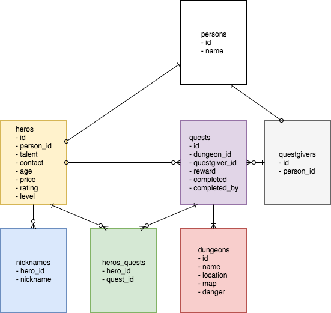

# Dungeonbase

**Dungeonbase** is a service that allows Heros and their clients to create, book, and complete Quests. You are building a web app for them. It should allow you to:

* List Heros and Quests
* Add Heros and Quests
* Assign Quests to Heros
* Modify and remove Heros and Quests

There may be some additional features, such as search, that are nice-to-haves, but a lower priority than the core features. Focus on the basic CRUD actions. The good people at Dungeonbase have provided you some sample data from their existing registry that you can use for development.

## Import stories into Issue Tracker

Import these user stories into a new project in the issue tracker of your choice. You may find it useful to prioritize the stories before you begin.

* As a user, I need to be able to identify the company (style/branding/logo)
* As a user, I need to be able to list all the Heros
* As a user, I need to be able to delete an existing Hero
* As a user, I need to be able to edit existing Hero
* As a user, I need to be able to link to a specific Hero
* As a user, I need to be able to list all the Quests
* As a user, I need to be able to easily navigate between Heros and Quests
* As a user, I need to be able to add a Quest
* As a user, I need to be able to assign a Hero to a Quest
* As a user, I need to be able to delete an existing Quest
* As a user, I need to be able to edit existing Quests
* As a user, I need to be able to link to a specific Quest
* As a user, I need to be able to link to a Quest from a Hero.
* As a user, I need to be able to link to a Hero from a Quest
* As a user, I need to be able to filter/sort Heros by price, Level, or rating
* As a user, I need to limit the number of Hero results I receive at a time
* As a user, I need to limit the number of Quests I receive at a time
* As a user, I need to search for Heros
* As a user, I need to be able to search for Quests
* As a user, I need to be able to search for active Quests
* As a user, I need to be able see the total number of Heros
* As a user, I need to be able to see the total number of Quests
* As a user, I need to be able to add a new Hero
* As a user, I need to be able to assign a Hero to a Quest
* As a user, I need to be able to complete a Quest
* As a user, I need to be able to remove a Hero from a Quest

## Sample Data

Your app should accommodate and make use of all of the following sample data, which can be downloaded [here](data/Heros.csv) and [here](data/Quests.csv). **Note that the data is denormalized,** and will require some transformation to get into the database.

1) Create an entity relationship diagram for the tables in the Dungeonbase database.
2) Create the Dungeonbase database, and write the knex migrations to create all the tables.
3) Write the knex files to seed the database with the following information:

### Heros

| Full Name        | Nicknames              | Talent                     | Contact Info             | Age | Price | Rating | Level |
|------------------|-------------------------|----------------------------|--------------------------|-----|-------|--------|-------|
| Bilbo Baggins    | Burglar                 | Theft                      | barrelrider@gmail.com    | 31  | 45    | 7.5    | 28    |
| Arya Stark       | A Girl                  | Disguise                   | faceless@gmail.com       | 52  | 40    | 9      | 72    |
|                  | The Doctor              | Running                    | jellybaby@gmail.com      | 28  | 20    | 6.5    | 35    |
| Rincewind        |                         | Accidents                  | disastermagnet@gmail.com | 27  | 25    | 7      | 48    |
| Roland Deschain  | Gunslinger              | Guns                       | towerfan@gmail.com       | 35  | 50    | 9.5    | 433   |
| Hermione Granger |                         | Intelligence               | nerdalert@gmail.com      | 26  | 15    | 6.5    | 13    |
| Buffy Summers    | The Slayer              | Everything                 | scooby1@gmail.com        | 41  | 30    | 8.5    | 87    |
| Thomas Anderson  | Neo, The One            | Spoon bending              | redpill@gmail.com        | 28  | 30    | 7      | 32    |
| Katniss Everdeen | The Girl on Fire        | Archery                    | D12_4_LYF@gmail.com      | 60  | 0     | 8      | 24    |

### Contracts

| Objective Name    | Objective Location | Objective Map                   | Objective Danger | Questgiver Name   | Budget |
|-------------------|--------------------|---------------------------------|------------------|-------------------|--------|
| Samwise Gamgee    | Mount Doom         | https://goo.gl/images/Egk7cD    | 3                | Gandalf           | 40     |
| Jon Snow          | Beyond the Wall    | https://goo.gl/images/bPVHyf    | 9                | Ned Stark         | 70     |
| Luke Skywalker    | Death Star         | https://goo.gl/images/W3ycjT    | 7                | Mon Mothma        | 35     |
| Rubeus Hagrid     | Hogwarts           | https://goo.gl/images/x7aafj    | 10               | Olympe Maxime     | 25     |
| Prim Everdeen     | The Capital        | https://goo.gl/images/TZpW4k    | 4                | Alma Coin         | 10     |

## ERD

## Notes

* Use feature-branch workflows.
* Deploy your work.

## How to Submit Your Assessment

Fork/clone this repo.
Add a README to your project that has:

* A link to your deployed site
* Link to your issue tracker
* Links to your repo with updated code
* A data model of the final data model of the project
